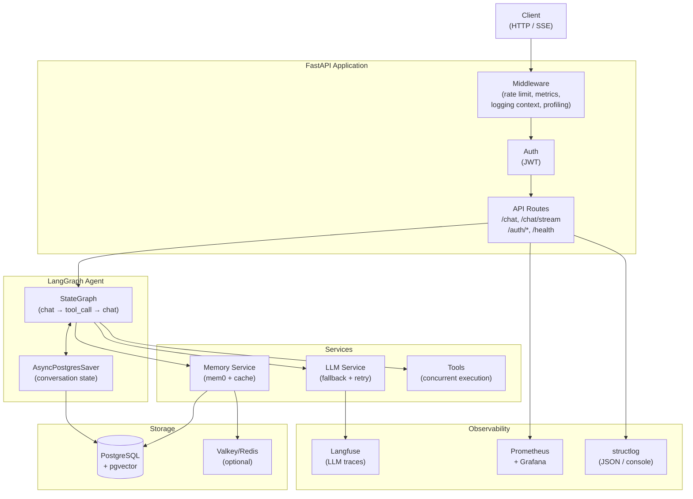
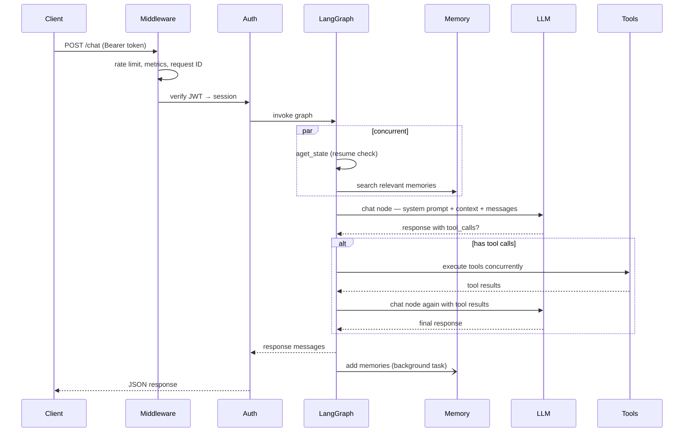
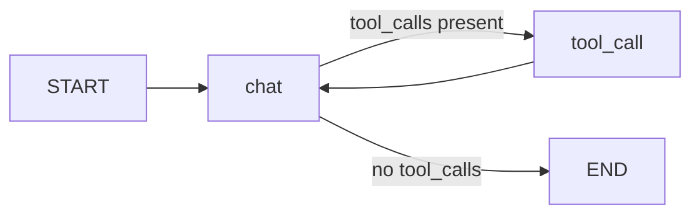

# Architecture

## System overview



## Request lifecycle



## Agent graph

The agent is a two-node `StateGraph`:



- **`chat` node** — builds the system prompt, calls the LLM, returns a `Command` routing to `tool_call` or `END`
- **`tool_call` node** — executes all tool calls concurrently, feeds results back to `chat`
- **Checkpointer** — `AsyncPostgresSaver` persists the full `GraphState` per `thread_id` (session), enabling resume on interrupts and multi-turn memory

## Three-layer workspace (G2)

Agent skills live in a three-layer nested workspace under `DATA_ROOT`
(`docs/changelog/agentapp-three-layer-refactor/spec-g2-workspace.md` v3.3):

```
{DATA_ROOT}/global/skills/<name>/SKILL.md                              # Global — single source of truth
{DATA_ROOT}/agents/<app_id>/skills/<name>/SKILL.md                     # Agent  — publish-time snapshot
{DATA_ROOT}/agents/<app_id>/users/<user_id>/skills/<name>/SKILL.md     # User   — per-(app, user) copy
```

**Copy timing (§4).**

- **publish** (`publish_agent_app`) snapshots the app's effective skills
  (own `skill_names` ∪ bound subagents' `skill_names`) from the Global layer
  into the Agent layer, then stores `workspace_hash` over the Agent dir.
- **associate** (`POST /apps/{id}/associate-user/{uid}`) materializes the
  User layer from the Agent snapshot.
- **lazy validation** (`ensure_user_workspace_up_to_date`, called from
  `get_runtime` before every runtime build) compares the association's
  `last_synced_workspace_hash` against the stored hash and re-syncs the User
  layer on drift — no cron, no eager sweep.
- **startup repair** (`ensure_all_agent_workspaces` in the FastAPI lifespan)
  re-materializes missing Agent layers of published apps and repairs hash
  drift; single-app failures are isolated.

**Fingerprint lock-in (§5).** The runtime cache is keyed by the triple
`(app_id, user_id, fingerprint)`. The fingerprint is computed by
`assembly.compute_fingerprint` from five inputs (app projection, subagent
projections, skill content hashes, MCP fingerprint, model fingerprint) and
deliberately **excludes** `workspace_hash`: skill-content changes already
drift the fingerprint through `skill_hashes`, while pure workspace
re-materialization only needs the lazy User-layer resync. The deepagents
`FilesystemBackend` of a compiled agent is rooted at the user workspace
(`{DATA_ROOT}/agents/<app_id>/users/<user_id>/`) with `/skills/<name>`
virtual mounts, so a session never escapes its own user layer.

## Key design decisions

**Memory search and state check run concurrently.** On every non-resumed request, `aget_state` (to check for interrupts) and `memory.search` (to fetch relevant memories) run in parallel with `asyncio.gather`, saving 200–500ms per request.

**Tool calls execute concurrently.** When the LLM returns multiple tool calls in one response, they all execute in parallel via `asyncio.gather`.

**System prompt cached at module load.** `system.md` is read once at startup. Per-request cost is only `.format()` with the user's name, current datetime, and retrieved memories — no file I/O.

**LLM fallback is time-bounded.** The entire fallback loop (retries × models) is wrapped in `asyncio.wait_for(timeout=LLM_TOTAL_TIMEOUT)` to prevent indefinite hangs.

**Username flows through session, not per-request DB lookup.** The user's display name is copied to `Session.username` at session creation time. Chat requests read it from the already-loaded session object — zero extra queries.

**Session titles are generated with zero added latency.** On the first message of an unnamed session, the API atomically claims the session with a placeholder name (a truncated version of the user's message), then fires a background `asyncio.Task` to call a fast nano model with structured output. The main chat response is returned immediately — title generation runs concurrently. An atomic `UPDATE … WHERE name = ''` in Postgres ensures exactly one worker wins the claim even under concurrent requests.

## Component responsibilities

| Component | File | Responsibility |
|---|---|---|
| LangGraph Agent | `app/core/langgraph/graph.py` | Orchestrates the conversation loop |
| LLM Service | `app/services/llm/` | Model registry, retries, circular fallback, structured output |
| Memory Service | `app/services/memory.py` | mem0 semantic memory + cache |
| Database Service | `app/services/database.py` | User account CRUD |
| Cache Service | `app/core/cache.py` | Valkey/Redis with in-memory fallback |
| Middleware | `app/core/middleware.py` | Metrics, logging context, profiling |
| Auth | `app/api/v1/auth.py` | JWT creation, session management |
| Agent Apps Service | `app/services/agents/agent_apps_service.py` | Publish/associate/PATCH state machine, lazy workspace validation |
| Skills Store | `app/services/agents/skills_store.py` | Three-layer skill filesystem + workspace hash computation |
| Agent Assembly | `app/services/agents/assembly.py` | Fingerprint + deepagents compile with per-user backend |
| Runtime Cache | `app/services/agents/runtime.py` | `(app_id, user_id, fingerprint)` runtime cache (TTL + LRU) |
| Bootstrap | `app/services/agents/bootstrap.py` | Startup workspace repair (`ensure_all_agent_workspaces`) |
