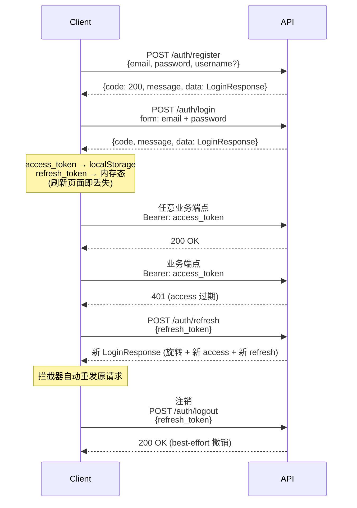

# Authentication

> Phase 1 G1 — single-layer authentication: **access_token + refresh_token**.

This document describes the user authentication flow as of the G1 refactor
(`docs/changelog/agentapp-three-layer-refactor/spec-g1-auth.md` §3.1).

**Status note**: Phase 1 G1 retired the legacy two-tier scheme (user token +
session token) **and the chatbot session runtime** together. The
`/chatbot/*` endpoints are shipped as a stub (no routes registered), and
`get_current_session` is gone from `app/api/v1/auth.py`. Business endpoints
all use `access_token` directly; the chat runtime will be redesigned in
Phase 2/3 on top of the new auth surface.

---

## Flow



All responses use the unified envelope `{code, message, data}` — `code` is numerically
identical to the HTTP status. Successful auth endpoints return HTTP 200 with `code=200`;
errors carry the status code with `data=null`.

---

## Tokens

| Token | Lifetime | Storage | Purpose |
|---|---|---|---|
| `access_token` | **7 days** (`JWT_ACCESS_TOKEN_EXPIRE_DAYS`) | localStorage `auth.userToken` | All business endpoints |
| `refresh_token` | **30 days** (`JWT_REFRESH_TOKEN_EXPIRE_DAYS`) | **In-memory only** (module closure variable) | Rotate access via `/auth/refresh` |

Both tokens are opaque strings from the client's perspective:

- `access_token` is a JWT (HS256) signed with `JWT_SECRET_KEY`. The `sub` claim carries
  the numeric `user.id`.
- `refresh_token` is a 64-character URL-safe base64 string (`secrets.token_urlsafe(48)`)
  with **384 bits of entropy**. Only its SHA-256 hex digest is persisted server-side
  (`refresh_token.token_hash`); the raw value is single-use and never re-derivable.

### Why refresh_token is in-memory only

`refresh_token` deliberately lives in a module-level JS variable, not in localStorage.
The reasoning:

1. **Reduce XSS exposure** — a 30-day bearer token in localStorage is a long-lived
   credential. Holding it only in memory forces an attacker to compromise the live
   tab, not the persisted store.
2. **Contain replay risk** — if the browser is closed, the refresh_token is gone.
   The blast radius of an accidental leak (e.g. screenshot, devtools snapshot pasted
   into a ticket) is bounded to the current session lifetime.
3. **Pair with short-lived access_token** — 7-day access tokens keep the XSS window
   tight. The refresh_token is the recovery path, not the daily-use credential.

**Trade-off**: closing or refreshing the page logs the user out, and they must log
back in. This is an explicit choice for Phase 1; if user friction outweighs the
security gain, Phase 3 can revisit.

---

## Endpoints

### `POST /api/v1/auth/register`

Create a new account. Phase 1 returns `LoginResponse` directly (no follow-up login
needed).

```json
{
  "email": "you@example.com",
  "password": "Secret123!",  // pragma: allowlist secret
  "username": "you"
}
```

Password requirements: 8+ chars, uppercase, lowercase, number, special character.

`username` is optional. When provided, it's passed to the agent's system prompt so the
LLM knows the user's name.

Response `data`:

```json
{
  "access_token": "eyJ...",
  "refresh_token": "abc123...",
  "token_type": "bearer",
  "expires_at": "2025-01-15T00:00:00Z"
}
```

---

### `POST /api/v1/auth/login`

Exchange credentials for an access + refresh token pair. Uses OAuth2 password grant
form fields.

```bash
curl -X POST /api/v1/auth/login \
  -F "email=you@example.com" \
  -F "password=Secret123!" \
  -F "grant_type=password"
```

Response `data` carries the same `LoginResponse` shape as register.

---

### `POST /api/v1/auth/refresh`

Rotate the refresh token. The old refresh_token is **revoked** and a new pair is issued.

```bash
curl -X POST /api/v1/auth/refresh \
  -H "Content-Type: application/json" \
  -d '{"refresh_token": "abc123..."}'
```

**Replay detection**: if a refresh_token arrives at `/auth/refresh` after it has already
been rotated (i.e. it was either used once and then re-used, or it was logged out
and then re-presented), the server treats this as a **replay attempt**:

1. The presented token is rejected with `401 REFRESH_TOKEN_REPLAY`.
2. **All** active refresh_tokens for that user are revoked — the user must re-login
   on every device.
3. The metric `auth_refresh_replay_total` is incremented (alert when > 0).

This protects against token theft: an attacker who captured a refresh_token, used it
once, then tries to reuse it is detected, and the legitimate user's other devices
are forced to re-authenticate (collateral damage is preferable to silent compromise).

Rate limit: **10 requests/minute/IP**.

---

### `POST /api/v1/auth/logout`

Revoke a refresh_token. Best-effort: unknown tokens return 200 (idempotent).

```bash
curl -X POST /api/v1/auth/logout \
  -H "Content-Type: application/json" \
  -d '{"refresh_token": "abc123..."}'
```

The endpoint does **not** invalidate the access_token — short-lived (7-day) access
tokens remain valid until they expire. Callers should discard local `auth.userToken`
and the in-memory `refresh_token` after a successful logout.

> **Phase 1 note**: there is no "log out all devices" endpoint yet. Each device owns
> its own refresh_token, and logout only revokes the specific token passed in.

---

## Retired: chatbot session API

> **Removed in Phase 1 G1.** `app/api/v1/chatbot.py` is shipped as a stub
> (no routes registered). The `POST /auth/session`, `PATCH /auth/session/{id}/name`,
> `DELETE /auth/session/{id}`, and `GET /auth/sessions` endpoints have all
> been removed together with the `get_current_session` dependency. No
> client should attempt to exercise these paths.

If you were relying on a chatbot runtime that issued a per-session JWT
and required `Authorization: Bearer <session-token>`, the migration is:

- Replace `Authorization: Bearer <session-token>` with `Authorization: Bearer <user-token>`
  (the same `access_token` you get from `/auth/login`).
- The session concept (multi-turn conversation state) is being redesigned
  in Phase 2/3 — until then, no chat endpoints are available.

---

## Security notes

### Password & credential handling

- Passwords are hashed with bcrypt before storage — plaintext is never persisted.
- Password validation enforces 8+ chars, uppercase, lowercase, number, special character.
- All string inputs are sanitised before use.

### Token integrity

- **access_token** is signed (HS256, `JWT_SECRET_KEY`); integrity protected against
  tampering. The `sub` claim carries the numeric `user.id`; the `jti` claim ensures
  token uniqueness.
- **refresh_token** is a 64-char URL-safe base64 random string (384 bits of entropy).
  Server-side storage is **SHA-256 hex digest** (`refresh_token.token_hash`, 64 chars).
  This means a database leak does not let an attacker recover usable refresh_tokens —
  pre-image attacks on SHA-256 with 384-bit input are computationally infeasible.
- Set a long random `JWT_SECRET_KEY` in production — at least 32 characters.

### Refresh token rotation

- Every successful `/auth/refresh` revokes the old refresh_token and issues a new one.
- Replay attempts (re-using a rotated refresh_token, or using a logged-out one) trigger
  full-user revocation and the `auth_refresh_replay_total` alert counter.

### Rate limits

| Endpoint | Limit | Purpose |
|---|---|---|
| `POST /auth/register` | 10 / hour / IP | Brute force account creation |
| `POST /auth/login` | 20 / minute / IP | Brute force credential guessing |
| `POST /auth/refresh` | 10 / minute / IP | Replay probe enumeration |
| `POST /auth/logout` | 20 / minute / IP | Revocation endpoint abuse |

### Observability

- `auth_refresh_total{status=success|replay_detected|invalid|expired}` — request outcome
  counter.
- `auth_refresh_replay_total` — **alert when > 0** (replay detection triggered).
- `auth_logout_total` — request counter.
- `refresh_token_active_count` — gauge of currently non-revoked, non-expired
  refresh_tokens (alert on abnormal growth, e.g. > 100 per user).

### Client-side token handling (agent-web)

- `access_token` is read from localStorage (`auth.userToken`) on every request by the
  `request.ts` request interceptor. It is sent as `Authorization: Bearer <token>` to
  all business endpoints.
- `refresh_token` lives in a module-level JS variable in `authStorage.ts`. Closing
  the browser tab erases it.
- On `401` from any business endpoint, the `request.ts` response interceptor:
  1. Calls `/auth/refresh` with the in-memory refresh_token.
  2. On success, retries the original request with the new access_token.
  3. On failure, clears all auth state and redirects to `/login?reason=expired`.
- The `_retried` flag on the request config prevents infinite recursion if the
  refresh endpoint itself returns 401.
- The `/auth/refresh` endpoint is excluded from auto-refresh — its 401 is treated as
  terminal (clear + redirect).

---

## Workspace isolation

G2 ships a three-layer workspace (`spec-g2-workspace.md` v3.3); every runtime
build is scoped to the `(app_id, user_id)` pair resolved from the caller's
access token:

```
{DATA_ROOT}/global/skills/<name>/SKILL.md                              # Global (single source)
{DATA_ROOT}/agents/<app_id>/skills/<name>/SKILL.md                     # Agent (publish snapshot)
{DATA_ROOT}/agents/<app_id>/users/<user_id>/skills/<name>/SKILL.md     # User (per-user copy)
```

### Per-(app_id, user_id) boundaries

- The deepagents `FilesystemBackend` of a compiled agent is rooted at
  `{DATA_ROOT}/agents/<app_id>/users/<user_id>/` and mounts `/skills/<name>`
  from it — a session can only read/write its own user's workspace, never the
  Global or Agent layer, and never another user's copy.
- User-layer copies are materialized from the Agent-layer snapshot at
  `POST /apps/{app_id}/associate-user/{user_id}` and lazily re-synced
  (`ensure_user_workspace_up_to_date`) whenever the stored `workspace_hash`
  drifts. Mutating one user's files never leaks into another user's copy.
- The runtime cache is keyed by the triple `(app_id, user_id, fingerprint)`,
  so cached compiled graphs are also isolated per user.

### Admin surface

- Association management (`POST/DELETE /apps/{app_id}/associate-user/{user_id}`)
  is the admin entry point for granting/revoking a user's workspace of a
  published app; it is rate-limited and audit-logged (`user_app_associated` /
  `user_app_disassociated`).
- The workspace columns of `AgentAppRead` (`workspace_hash`,
  `agent_workspace_status`) expose the materialization state to operators via
  `GET /apps/{app_id}`; there is no endpoint that streams raw workspace file
  contents across users.

---

## Configuration

| Env var | Default | Purpose |
|---|---|---|
| `JWT_SECRET_KEY` | (required in prod) | HMAC secret for access_token signing |
| `JWT_ALGORITHM` | `HS256` | JWT signing algorithm |
| `JWT_ACCESS_TOKEN_EXPIRE_DAYS` | `7` | access_token lifetime |
| `JWT_REFRESH_TOKEN_EXPIRE_DAYS` | `30` | refresh_token lifetime |

`.env.example` and `.env.development` should mirror these defaults.

---

## Migration notes

### From the old (user token + session token) scheme

| Old | New (Phase 1) |
|---|---|
| `POST /auth/login` → `{access_token, expires_at}` (30 days) | `POST /auth/login` → `{access_token, refresh_token, expires_at}` (7 + 30 days) |
| `POST /auth/register` → `UserResponse{..., token: TokenResponse}` | `POST /auth/register` → `LoginResponse` directly |
| `POST /auth/session` → session token (used for `/chatbot/*`) | **Retired** — chatbot runtime redesigned in Phase 2/3 |
| `PATCH/DELETE /auth/session/{id}` (session CRUD) | **Retired** — no client should call these |
| Frontend persists session token | Frontend persists access_token + holds refresh_token in memory |
| 401 → redirect to `/login` | 401 → automatic refresh + retry → if still 401 → redirect |

### Storage keys (localStorage)

| Key | Value | Status |
|---|---|---|
| `auth.userToken` | `access_token` | **New** (Phase 1) |
| `auth.user` | `{id, email, username}` JSON | Existing |
| `auth.sessionToken` | session token | **Removed in Phase 1** (chatbot retired; no client writes this key) |
| `auth.refreshToken` | (intentionally absent) | Never written — refresh_token is in-memory |