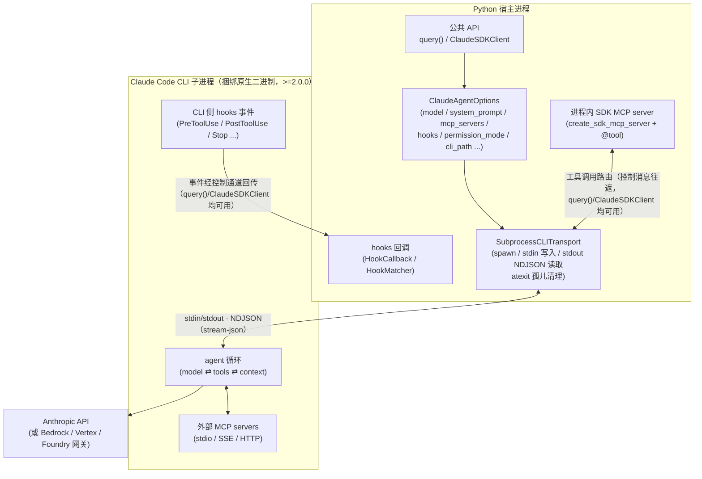
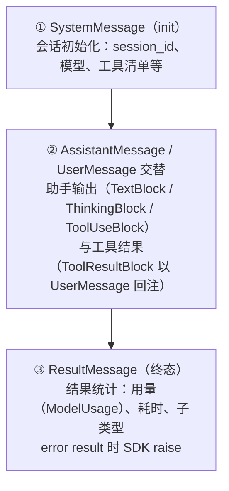

# 01 · 架构总览与运行时数据流

> 本章覆盖：子进程架构（SDK → SubprocessCLITransport → NDJSON → 捆绑 CLI → Anthropic API）、`query()` vs `ClaudeSDKClient` 双 API 选型、进程模型与孤儿清理、FastAPI 宿主并发会话模式、消息生命周期与异常族。每条关键结论均标注出处。
>
> 版本基准：`claude-agent-sdk 0.2.135`（调研日期 2026-08-11）。导航见 [README.md](./README.md)。
> 架构官方口径出处：<https://code.claude.com/docs/en/agent-sdk/overview>。

---

## 目录

1. [子进程架构](#1-子进程架构)
2. [双 API：query() vs ClaudeSDKClient 选型](#2-双-apiquery-vs-claudesdkclient-选型)
3. [进程模型与开销](#3-进程模型与开销)
4. [FastAPI 宿主并发会话模式](#4-fastapi-宿主并发会话模式)
5. [运行时数据流：消息生命周期与异常族](#5-运行时数据流消息生命周期与异常族)
6. [后续章节导航](#6-后续章节导航)

---

## 1. 子进程架构

Claude Agent SDK 是 **Python 侧的薄层封装**：agent 循环（模型 ⇄ 工具）、上下文管理、LLM 调用全部发生在 Claude Code CLI 子进程内，SDK 只负责进程生命周期与 NDJSON 协议翻译（出处：官方文档 <https://code.claude.com/docs/en/agent-sdk/overview>、`src/claude_agent_sdk/_internal/transport/subprocess_cli.py`）。



| 层 | 定位 | 关键事实 | 出处 |
|---|---|---|---|
| **Python SDK** | 薄层封装 | `query()` / `ClaudeSDKClient` 只做选项序列化、进程管理与消息解码；不做 LLM 调用 | `src/claude_agent_sdk/query.py`、`src/claude_agent_sdk/client.py` |
| **Transport** | 进程与协议层 | `SubprocessCLITransport` spawn CLI 子进程；stdin/stdout 走 NDJSON（stream-json）；`Transport` 抽象基类为**低层不稳定 API** | `src/claude_agent_sdk/_internal/transport/subprocess_cli.py`、`_internal/transport/__init__.py` |
| **Claude Code CLI** | agent 运行时 | agent 循环、工具执行、上下文压缩、LLM 调用全部在 CLI 侧；由 wheel 捆绑原生二进制（`>=2.0.0`） | 官方文档 <https://code.claude.com/docs/en/agent-sdk/overview>、`subprocess_cli.py::MINIMUM_CLAUDE_CODE_VERSION` |
| **控制通道** | 双向扩展 | 进程内自定义工具（SDK MCP server）与 hooks 回调经控制消息往返；**0.2.135 中 `query()` 与 `ClaudeSDKClient` 均可用**——两者共用 `_internal/client.py::_process_query_inner`，内部恒以 streaming mode 构造 Query（源码注释「Always use streaming mode internally」），控制通道恒建立 | `src/claude_agent_sdk/_internal/client.py`、官方文档 <https://code.claude.com/docs/en/agent-sdk/custom-tools> |

**关键结论**：评估该 SDK 时，成本模型与故障域应按「子进程 + NDJSON IPC」计，而非「进程内 agent 框架」——每次会话多一个 OS 进程，观测、限流、日志路由都要跨进程设计。

---

## 2. 双 API：query() vs ClaudeSDKClient 选型

出处：`src/claude_agent_sdk/query.py`（docstring 的「Key differences」节）、`src/claude_agent_sdk/client.py`、官方文档 <https://code.claude.com/docs/en/agent-sdk/streaming-vs-single-mode>。

| 维度 | `query()` | `ClaudeSDKClient` |
|---|---|---|
| 定位 | 一次性 / 单向（可流式投喂 prompt，仍是单向） | 双向交互式长会话 |
| 签名/入口 | `query(*, prompt: str \| AsyncIterable[dict], options=None, transport=None) -> AsyncIterator[Message]` | `ClaudeSDKClient(options)`；`connect()` / `disconnect()`；支持 `async with` |
| 会话状态 | 无状态，每次调用独立 | 有状态，同一进程内多轮 `query()` + `receive_messages()` / `receive_response()` |
| 交互能力 | 发完即收，不可中断、不可追加 | `interrupt()`、`set_model()`、`set_permission_mode()`、`rewind_files()`、`get_mcp_status()`、`reconnect_mcp_server()`、`toggle_mcp_server()`、`get_context_usage()` 等 |
| 进程内自定义工具（SDK MCP server） | ✅ 可用 | ✅ 可用 |
| hooks 回调（`HookCallback`） | ✅ 可用 | ✅ 可用 |
| 进程生命周期 | 每次调用 spawn 一个 CLI 子进程，迭代结束即回收 | `connect()` 时 spawn，长会话复用同一进程，`disconnect()` 回收 |
| 错误语义 | 收到 error result 后 raise（异常族见第 5 节） | 同族异常；连接/进程错误经 `CLIConnectionError` 等抛出 |
| 典型场景 | 脚本、CI/CD、批处理、代码生成分析 | 聊天应用、REPL、需要根据响应决定下一步输入的 agent |

> ⚠️ **事实澄清（0.2.135 源码核实）**：hooks 与进程内 SDK MCP server 在 `query()` 中**同样可用**（内部恒 streaming mode，控制通道恒建立，出处：`src/claude_agent_sdk/_internal/client.py`）。唯一真实限制：`can_use_tool` 搭配**字符串 prompt** 会 raise，须改用 `AsyncIterable` prompt（出处：`_internal/client.py::_process_query_inner`）。
>
> 选型口诀：**能用 `query()` 就用 `query()`**（更简单、无连接管理负担）；需要多轮对话、`interrupt()` / `set_model()` / `set_permission_mode()` 等交互能力时用 `ClaudeSDKClient`——其选型价值在交互能力，而非控制通道有无。

---

## 3. 进程模型与开销

出处：`src/claude_agent_sdk/_internal/transport/subprocess_cli.py`（`_ACTIVE_CHILDREN`、`_kill_active_children`、`atexit.register` 与模块注释）。

- **一次会话 = 一个独立 CLI 子进程**：每个 `query()` 调用或每个 `ClaudeSDKClient` 连接对应一个 CLI 子进程；会话间完全隔离。
- **孤儿进程防护**：SDK 维护进程级集合 `_ACTIVE_CHILDREN`，并通过 `atexit.register(_kill_active_children)` 在宿主进程退出时对全部存活子进程发 `SIGTERM`（Windows 上 anyio 将其映射为 `terminate()`）——防止调用方崩溃或提前退出时 `claude` 进程泄漏（源码注释原意：与 TypeScript SDK 的父进程退出清理行为对齐）。
- **Transport 抽象**：`Transport` 是公共导出的抽象基类（`__all__` 含 `Transport`），可实现自定义传输；但官方标注其为**低层、不稳定 API**，不建议业务代码依赖（出处：`src/claude_agent_sdk/_internal/transport/__init__.py`、官方文档 <https://code.claude.com/docs/en/agent-sdk/python>）。
- **开销提示**：子进程冷启动（进程创建 + CLI 初始化 + MCP server 握手）是每次会话的固定成本；高并发宿主必须做**进程复用（长连接客户端）与并发上限控制**，见第 4 节。

---

## 4. FastAPI 宿主并发会话模式

在 FastAPI 这类常驻宿主中承载多用户会话时，推荐「**注册表 + 信号量进程上限 + 空闲回收**」三件套（概念骨架，非官方代码）：

```python
# 概念骨架：会话级 ClaudeSDKClient 注册表 + 子进程并发上限 + 空闲回收
import asyncio
from contextlib import asynccontextmanager

from claude_agent_sdk import ClaudeAgentOptions, ClaudeSDKClient

MAX_CONCURRENT_SESSIONS = 16          # 子进程并发上限（按宿主机资源定）
_semaphore = asyncio.Semaphore(MAX_CONCURRENT_SESSIONS)
_registry: dict[str, ClaudeSDKClient] = {}   # session_id -> 复用的客户端

@asynccontextmanager
async def acquire_client(session_id: str, options: ClaudeAgentOptions):
    client = _registry.get(session_id)
    if client is None:
        async with _semaphore:                 # 限制同时存活的 CLI 子进程数
            client = ClaudeSDKClient(options)
            await client.connect()
            _registry[session_id] = client
    try:
        yield client
    except Exception:
        raise                                  # 错误处理与日志由宿主统一承担

async def evict_idle(idle_seconds: float) -> None:
    """后台任务：空闲超时的会话 disconnect() 回收子进程（需宿主记录 last_used）。"""
    ...                                        # 省略：遍历 registry，超时者 disconnect + 移除
```

要点：

- **进程上限**：每个活跃 `ClaudeSDKClient` 占一个 CLI 子进程，必须有信号量/配额约束，避免进程数失控。
- **复用而非重连**：同一会话的多轮请求复用同一 client（同一子进程），避免重复冷启动。
- **空闲回收**：超时 `disconnect()` 释放子进程；会话恢复可借助 sessions（resume / fork）能力，见 [07-流式输出与交互式会话.md](./07-流式输出与交互式会话.md)。
- **优雅关停**：FastAPI `lifespan` 退出时应遍历 registry 逐一 `disconnect()`；即便遗漏，SDK 的 atexit 清理是最后兜底（第 3 节），但不应依赖它做正常回收。

---

## 5. 运行时数据流：消息生命周期与异常族

### 5.1 消息生命周期

一次会话的消息流（`AsyncIterator[Message]`）的典型形态（出处：`src/claude_agent_sdk/types.py` 消息类型定义、官方文档 <https://code.claude.com/docs/en/agent-sdk/streaming-vs-single-mode>）：



要点：

- **首条为 init 性质的 `SystemMessage`**，携带会话元信息；`AssistantMessage` 与 `UserMessage`（工具结果回注）交替推进，**末条恒为 `ResultMessage`**（出处：`src/claude_agent_sdk/client.py::receive_response` docstring：「The final message in the list will always be a ResultMessage」）。
- 内容块类型：`TextBlock` / `ThinkingBlock` / `ToolUseBlock` / `ToolResultBlock`（另有 `ServerToolUseBlock` / `ServerToolResultBlock` 用于 CLI 内置服务端工具），出处：`src/claude_agent_sdk/types.py`。
- `query()` 收到 **error result 会 raise**（而非静默产出），宿主须按第 5.2 节异常族捕获。

### 5.2 异常族

出处：`src/claude_agent_sdk/_errors.py`、公共导出见 `src/claude_agent_sdk/__init__.py`。

| 异常 | 触发场景（一句话） |
|---|---|
| `ClaudeSDKError` | 异常族基类，SDK 层通用错误 |
| `CLINotFoundError` | 找不到 Claude Code CLI 可执行文件（未捆绑/不在 PATH/`cli_path` 无效） |
| `CLIConnectionError` | 与 CLI 子进程的连接/通信失败（启动失败、管道中断等） |
| `ProcessError` | CLI 子进程异常退出（携带退出码） |
| `CLIJSONDecodeError` | stdout NDJSON 行解码失败（协议层脏数据） |

> 宿主侧捕获策略：`except ClaudeSDKError` 兜底整个异常族；对 `CLINotFoundError`（部署问题）与 `ProcessError`（可重试的进程崩溃）建议区分处置。

---

## 6. 后续章节导航

| 下一步 | 文档 |
|---|---|
| 模型选择、重试/回退与网关接入 | [02-LLM集成与成本控制.md](./02-LLM集成与成本控制.md) |
| system prompt 三形态与语义 | [03-System-Prompt系统.md](./03-System-Prompt系统.md) |
| `ClaudeAgentOptions` 全字段速查 | [08-API参考.md](./08-API参考.md) |
| 外部与进程内 MCP 集成 | [06-MCP集成.md](./06-MCP集成.md) |
| streaming / 交互客户端 / sessions / hooks | [07-流式输出与交互式会话.md](./07-流式输出与交互式会话.md) |
| 上一章 | [00-安装与快速入门.md](./00-安装与快速入门.md) |
| 返回导航 | [README.md](./README.md) |
