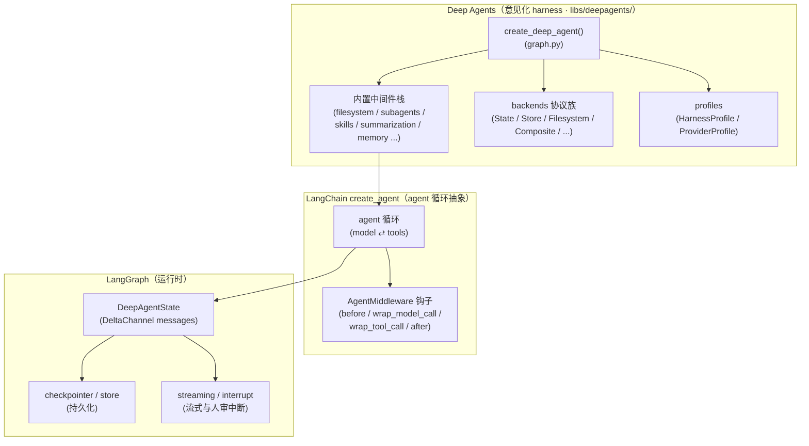
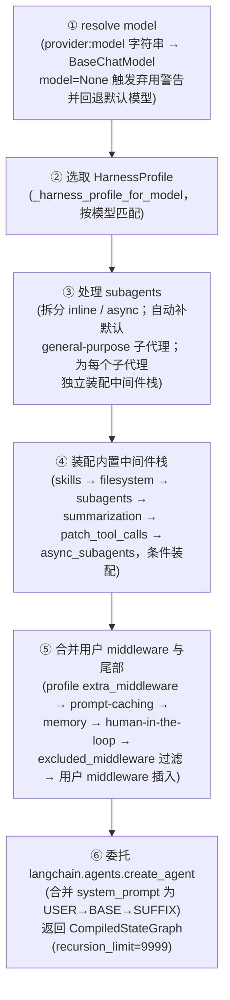
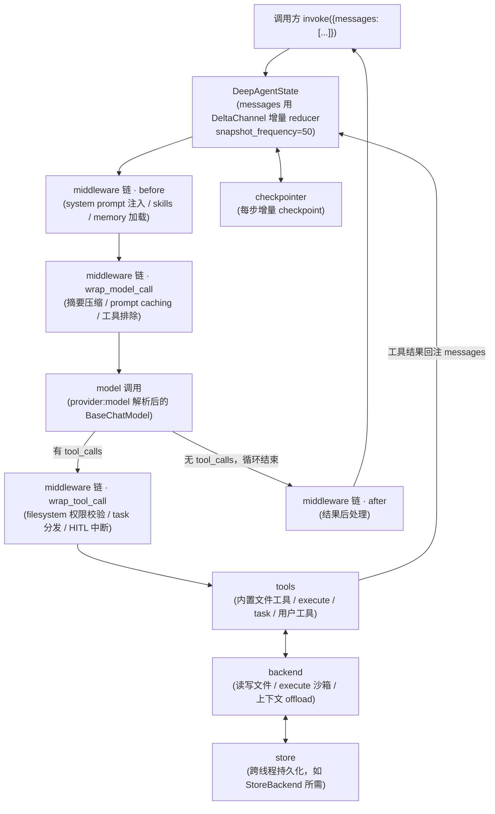

# 01 · 架构总览与运行时数据流

> 本章覆盖：deepagents 的三层架构、`create_deep_agent` 组装流程、默认中间件栈完整顺序、运行时数据流、backends 协议族、profiles 机制。每条关键结论均标注源码出处。
>
> 版本基准：`deepagents 0.7.5`（调研日期 2026-08-11）。导航见 [README.md](./README.md)。
> 三层架构的官方口径出处：`libs/ARCHITECTURE.md`。

---

## 目录

1. [三层架构](#1-三层架构)
2. [create_deep_agent 组装流程](#2-create_deep_agent-组装流程)
3. [默认中间件栈完整顺序](#3-默认中间件栈完整顺序)
4. [运行时数据流](#4-运行时数据流)
5. [backends 协议族速览](#5-backends-协议族速览)
6. [profiles 机制](#6-profiles-机制)
7. [公共导出速览](#7-公共导出速览)

---

## 1. 三层架构

deepagents 是建立在 LangChain / LangGraph 之上的**意见化（opinionated）harness**，自上而下三层：

| 层 | 定位 | 提供什么 | 官方依据 |
|---|---|---|---|
| **Deep Agents** | 意见化 harness | 内置中间件栈（文件系统、子代理、技能、摘要、记忆）、backends、profiles、subagents | `libs/ARCHITECTURE.md`、`libs/deepagents/deepagents/graph.py` |
| **LangChain `create_agent`** | agent 循环抽象 | model ⇄ tools 循环、`AgentMiddleware` 钩子协议、structured output | `langchain.agents.create_agent`（deepagents 直接委托） |
| **LangGraph** | 运行时 | state 模型、checkpoint、streaming、interrupt | `langgraph.graph.state.CompiledStateGraph`（`create_deep_agent` 的返回类型） |

**关键结论**：deepagents 本身不实现 agent 循环与图运行时——`create_deep_agent` 组装完中间件栈后**委托** `langchain.agents.create_agent`，最终返回一个 LangGraph `CompiledStateGraph`，并通过 `.with_config()` 附加 `recursion_limit=9999` 与 `metadata: {"ls_integration": "deepagents", ...}`（出处：`libs/deepagents/deepagents/graph.py` 末尾）。

---

## 2. create_deep_agent 组装流程

入口：`libs/deepagents/deepagents/graph.py::create_deep_agent()`。完整参数表留待 `08-API参考.md`；组装过程按源码执行顺序概括为六步：

各步要点（出处均在 `graph.py`）：

| 步骤 | 关键行为 | 出处符号 |
|---|---|---|
| ① resolve model | `model` 字符串经 `resolve_model` 解析；`model=None` 自 `0.5.3` 弃用、`1.0.0` 移除 | `resolve_model`（`deepagents/_models.py`）、`warn_deprecated` |
| ② 选取 profile | 按模型匹配 `HarnessProfile`，并校验其 `excluded_middleware` 不触碰受保护脚手架 | `_harness_profile_for_model`、`_validate_excluded_middleware_config` |
| ③ subagents | 声明式 `SubAgent` 会被补全默认值并独立装配中间件栈；`AsyncSubAgent` 路由到 async 中间件；未提供 `general-purpose` 且 profile 未禁用时自动注入默认通用子代理 | `GENERAL_PURPOSE_SUBAGENT`、`_apply_custom_middleware` |
| ④ 内置栈 | 按第 3 节表格条件装配；`backend` 缺省为 `StateBackend()` | `deepagent_middleware` 构建段 |
| ⑤ 合并与过滤 | 用户 `middleware` 若与既有项同名则**原位替换**，否则插入到核心栈之后、尾部（profile/prompt-caching/memory）之前；profile 的 `excluded_middleware` 过滤前后各跑一次 | `_apply_custom_middleware`、`_apply_excluded_middleware` |
| ⑥ 委托 | 全部中间件、tools、system_prompt 交给 `create_agent`；state 缺省用 `DeepAgentState` | `create_agent(...).with_config({...})` |

**受保护脚手架**：`FilesystemMiddleware` 与 `SubAgentMiddleware` 登记在 `_REQUIRED_MIDDLEWARE` 中，profile 的 `excluded_middleware` 试图排除它们会直接抛 `ValueError`——移除任一项都会静默破坏内置文件工具 / `task` 工具（出处：`graph.py` 中 `_REQUIRED_MIDDLEWARE` 定义与注释）。

---

## 3. 默认中间件栈完整顺序

出处：`libs/deepagents/deepagents/graph.py`（`create_deep_agent` docstring 的「Base stack / Tail stack」与函数体装配代码，两者一致核对）。

| # | 中间件 | 职责（一句话） | 条件装配 | 受保护 |
|---|---|---|---|---|
| 1 | `SkillsMiddleware` | 从 backend 加载 skill 源目录，向模型暴露技能索引 | 仅当传入 `skills` | 否 |
| 2 | `FilesystemMiddleware` | 注入文件工具（`ls`/`read_file`/`write_file`/`edit_file`/`glob`/`grep`）并执行 `permissions` 规则 | 始终装配 | ✅（`_REQUIRED_MIDDLEWARE`） |
| 3 | `SubAgentMiddleware` | 注入 `task` 工具，调度同步子代理（含自动注入的 general-purpose） | 存在任一同步子代理时 | ✅（`_REQUIRED_MIDDLEWARE`） |
| 4 | `SummarizationMiddleware` | 上下文超限时对历史消息做摘要压缩 | 始终装配（`create_summarization_middleware`） | 否（可被 profile 排除） |
| 5 | `PatchToolCallsMiddleware` | 修补/规整模型返回的 tool_calls | 始终装配 | 否 |
| 6 | `AsyncSubAgentMiddleware` | 以非阻塞方式调度远程/后台子代理（LangSmith 部署） | 仅当存在 `AsyncSubAgent` | 否 |
| — | **用户 `middleware`** | 同名原位替换；新条目插入核心栈之后、尾部之前 | 由调用方传入 | — |
| 7 | profile `extra_middleware` | harness profile 按模型附加的中间件 | profile 声明时 | 否 |
| 8 | prompt-caching 中间件 | `AnthropicPromptCachingMiddleware` 无条件装配（非 Anthropic 模型下 no-op）；装有 `langchain-aws` / `langchain-fireworks` 时分别追加 Bedrock / Fireworks 对应中间件 | 无条件（Anthropic 项） | 否 |
| 9 | `MemoryMiddleware` | 启动时加载 `AGENTS.md` 记忆文件并注入 system prompt | 仅当传入 `memory` | 否 |
| 10 | `HumanInTheLoopMiddleware` | 在指定工具调用前暂停等待人审 | 传入 `interrupt_on`，或 `permissions` 含 `interrupt` 模式规则时自动安装 | 否 |
| 11 | `_ToolExclusionMiddleware` | profile 有 `excluded_tools` 时追加于整个栈的最后（用户 middleware、profile extra、prompt-caching、Memory、HITL 之后；源码注释：“Tool exclusion runs after custom middleware so excluded tool names are stripped last”——确保被排除的工具名在最后才被剥离，不会被自定义 `wrap_model_call` 复活） | profile 有 `excluded_tools` 时 | — |

两条值得记住的设计决策（出处：`graph.py` 注释）：

- **profile `extra_middleware` 放在 memory 之前**：memory 更新会改变 system prompt，若在其后叠加中间件会破坏 Anthropic prompt cache 前缀。
- **prompt-caching 位于尾部链**：与上条配合，保证缓存断点打在稳定前缀上。

---

## 4. 运行时数据流

运行期视角：一次 `invoke` 在三层之间的数据流。

要点：

- **`DeepAgentState.messages` 使用 `DeltaChannel` 增量 reducer**（`snapshot_frequency=50`），将 checkpoint 增长从 O(N²) 降到 O(N)——这是 deepagents 对 LangGraph 运行时的关键优化，长对话持久化成本显著下降（出处：`graph.py` 中 `DeepAgentState` 定义，reducer 实现见 `deepagents/_messages_reducer.py`）。
- middleware 钩子（`before` / `wrap_model_call` / `wrap_tool_call` / `after`）属于 LangChain `AgentMiddleware` 协议，deepagents 的全部内置能力都通过这四个钩子接入，不侵入 agent 循环。
- **backend 是文件与执行的统一抽象**：文件工具、`execute`（要求 backend 实现 `SandboxBackendProtocol`）、摘要与 skills 的文件存取都经由 backend；工具输出还可 offload 到 `context_hub` 以控制上下文体积（见第 5 节）。
- checkpoint / store / streaming / interrupt 全部由 LangGraph 运行时承载；`interrupt_on` 与 `permissions` 的 `interrupt` 模式经 `HumanInTheLoopMiddleware` 落地（出处：`graph.py::_merge_fs_interrupt_on`、`deepagents/middleware/_fs_interrupt.py`）。

---

## 5. backends 协议族速览

出处：`libs/deepagents/deepagents/backends/`（目录实测）。协议定义在 `protocol.py`：`BackendProtocol`（文件读写）与 `SandboxBackendProtocol`（附加 `execute` 执行能力）。

| backend | 定位 | 适用场景 | 出处文件 |
|---|---|---|---|
| `StateBackend` | **默认**；文件存放在 graph state 中，thread-scoped | 无外部存储依赖的最小起步；随 checkpoint 持久化 | `backends/state.py` |
| `StoreBackend` | 文件存放在 LangGraph `BaseStore`，跨线程可见 | 多会话共享文件（需给 `create_deep_agent` 传 `store`） | `backends/store.py` |
| `FilesystemBackend` | 真实磁盘目录（`root_dir`） | 本地工程类 agent（读真实代码库）；skills 按磁盘相对路径加载 | `backends/filesystem.py` |
| `CompositeBackend` | 按路径前缀把读写路由到不同 backend | 「`/tmp` 走沙箱、`/docs` 走磁盘」式混合策略 | `backends/composite.py` |
| local shell backend | `SandboxBackendProtocol` 的本地 shell 实现 | `execute` 工具直接跑宿主机命令（注意安全边界） | `backends/local_shell.py` |
| sandbox backend | 远程/隔离沙箱执行接入 | 需要隔离的 `execute` 场景 | `backends/sandbox.py` |
| LangSmith backend | 基于 LangSmith 部署的运行环境接入 | 与 `AsyncSubAgent`（LangSmith deployments）配套的托管执行 | `backends/langsmith.py` |
| `context_hub` | 工具输出 offload 机制（非文件存储 backend） | 大工具输出卸载出上下文，控制 token 体积 | `backends/context_hub.py` |

**自定义扩展点**：实现 `BackendProtocol`（文件语义）或进一步实现 `SandboxBackendProtocol`（执行语义）即可接入自定义存储/沙箱，无需改动中间件栈——详细做法与注意事项见 `09-高级用法与二次开发最佳实践.md`。

---

## 6. profiles 机制

deepagents 用两类 profile 做「按模型/provider 的差异化适配」，两者均在 `deepagents/__init__.py` 公共导出：

| profile | 定位 | 关键能力 | 注册入口 | 出处 |
|---|---|---|---|---|
| `HarnessProfile` | **按模型调 harness 行为** | `base_system_prompt` / `system_prompt_suffix`（prompt 叠加）、`extra_middleware`（附加中间件）、`excluded_middleware` / `excluded_tools`（能力裁剪）、`tool_description_overrides`、`general_purpose_subagent` 开关 | `register_harness_profile`；亦支持 entry-point 插件注册 | `deepagents/profiles/harness/harness_profiles.py` |
| `ProviderProfile` | **按 provider 调接入参数** | provider 级模型/参数默认配置；内置 OpenRouter / NVIDIA / OpenAI 配置 | `register_provider_profile` | `deepagents/profiles/provider/provider_profiles.py` |

运行时选取逻辑：`create_deep_agent` 在 resolve model 后调用 `_harness_profile_for_model(model, _model_spec)` 选取 harness profile，随后 profile 参与 prompt 组装（第 2 章步骤②与第 ⑤ 步尾部链）、中间件过滤与工具裁剪。profile 的约束边界：**`excluded_middleware` 不得排除受保护脚手架**（`FilesystemMiddleware` / `SubAgentMiddleware`），不得引用私有（下划线前缀）名称，未命中任何已装配中间件时抛 `ValueError`（出处：`graph.py` 的 Raises 说明与 `_excluded_middleware.py`）。

---

## 7. 公共导出速览

出处：`libs/deepagents/deepagents/__init__.py`（`__all__` 实测）。

| 分组 | 导出 |
|---|---|
| 入口与状态 | `create_deep_agent`、`DeepAgentState`、`__version__` |
| 子代理 | `SubAgent`、`CompiledSubAgent`、`SubAgentMiddleware`、`AsyncSubAgent`、`AsyncSubAgentMiddleware` |
| 文件系统 | `FilesystemMiddleware`、`FilesystemPermission`、`FsToolName` |
| 记忆与评估 | `MemoryMiddleware`、`RubricMiddleware` |
| profiles | `HarnessProfile`、`HarnessProfileConfig`、`GeneralPurposeSubagentProfile`、`register_harness_profile`、`ProviderProfile`、`register_provider_profile` |

> 更完整的签名与类型信息见 [08-API参考.md](./08-API参考.md)。

---

*上一章：[00-安装与快速入门.md](./00-安装与快速入门.md) · 返回导航：[README.md](./README.md) · 下一章：[02-LLM集成.md](./02-LLM集成.md)*
