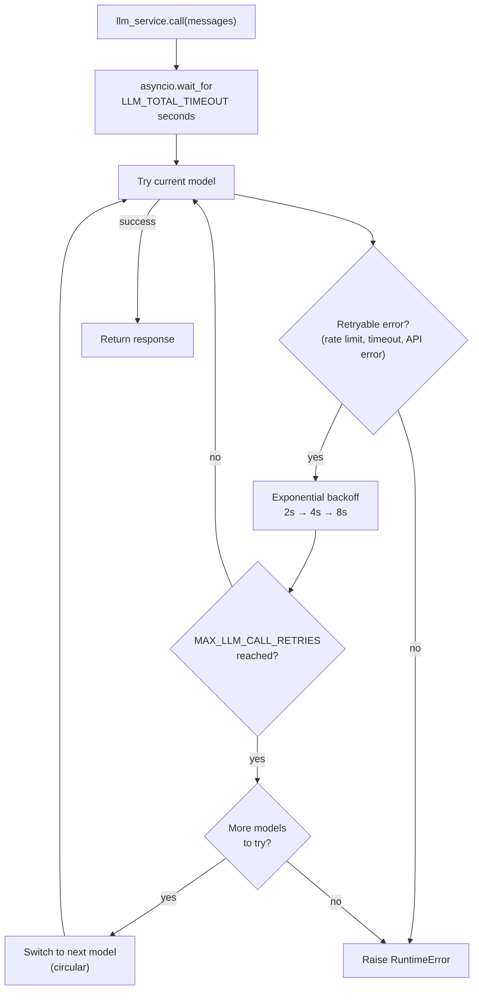

# LLM Service

## Overview

The LLM service (`app/services/llm/`) handles all language model calls with automatic retries, circular model fallback, and a total timeout budget. Your agent code calls `llm_service.call(messages)` — the service handles everything else.

The package is split into three modules:

- `app/services/llm/registry.py` — `LLMRegistry`: defines available models (system-level call sites only)
- `app/services/llm/service.py` — `LLMService`: call logic, retries, fallback, structured output
- `app/services/llm/llm_store.py` — DB-backed LLM configuration resolution for the agent asset chain

## Two resolution chains

LLM configuration is split into two independent chains:

- **System-level chain (env-driven)**: session naming, skill draft generation, `LLMService`
  circular fallback and evals keep using `LLMRegistry`, whose `ChatOpenAI` instances read
  `OPENAI_API_KEY` and fall back to the `OPENAI_BASE_URL` / `OPENAI_API_BASE` environment
  variables for the endpoint. Model names stay the hard-coded registry list below.
- **Agent asset chain (DB-driven)**: every AgentApp/SubAgent `model` field is a
  **`provider/model` reference** (NULL resolves to `default/default`). Provider rows
  (credentials, endpoint, type) and model rows (model_id, context_size, extra_params)
  live in the `provider` / `model_config` tables and are managed through the
  `/providers` CRUD API; `llm_store.load_model_config` + `llm_store.build_chat_model`
  resolve a reference into a fresh `ChatOpenAI` instance at assembly/test-run time. Any
  OpenAI-compatible endpoint and model name can be configured per provider/model pair
  (e.g. a MiniMax-M3 proxy) without code changes. The `default` provider/model pair is
  seeded once at bootstrap from `OPENAI_API_KEY` / `OPENAI_BASE_URL` / `DEFAULT_LLM_MODEL`
  / `DEFAULT_LLM_TEMPERATURE` (insert-if-missing only — editing env vars afterwards does
  not overwrite the stored rows).

API responses never expose `api_key` plaintext; reads return `api_key_masked` (`****` + last four characters).

The registry section below documents the **system-level** chain only.

## Model registry

Models are defined in `LLMRegistry.LLMS` in order of preference:

| Name           | Model        | Notes                                  |
| -------------- | ------------ | -------------------------------------- |
| `gpt-5-mini`   | gpt-5-mini   | Default. Low reasoning effort.         |
| `gpt-5.4`      | gpt-5        | Medium reasoning effort.               |
| `gpt-5.4-nano` | gpt-5.4-nano | Fast, low reasoning effort.            |
| `gpt-5`        | gpt-5        | Full model, production-tuned sampling. |

Set `DEFAULT_LLM_MODEL` in your `.env` to choose the starting model (it also seeds the
`default` model's `model_id` for the agent asset chain at first bootstrap).

To add or change models, edit `LLMRegistry.LLMS` in `app/services/llm/registry.py`.

## Retry and fallback behaviour



**Retry config** (per model):

- Max attempts: `MAX_LLM_CALL_RETRIES` (default: 3)
- Wait: exponential backoff, 2s min, 10s max
- Retries on: `RateLimitError`, `APITimeoutError`, `APIError`

**Total timeout**: `LLM_TOTAL_TIMEOUT` seconds (default: 60s) caps the entire loop. Without this, worst case is `retries × models × max_wait` — potentially 2+ minutes.

**Fallback order**: circular through `LLMRegistry.LLMS`. After the last model, wraps back to the first and stops after one full cycle.

## Tools

Tools are bound to the LLM at startup:

```python
llm_service.bind_tools(tools)
```

When a model is switched during fallback, the tools are re-bound to the new model automatically.

## Structured output

Pass a Pydantic model as `response_format` to get a validated instance back instead of a raw `BaseMessage`:

```python
from app.schemas.my_schema import MySchema

result: MySchema = await llm_service.call(
    messages,
    model_name="gpt-5.4-nano",   # optional — uses current default if omitted
    response_format=MySchema,
    temperature=0.2,
)
```

The service chains `.with_structured_output(schema)` on the resolved model and re-wraps it on every fallback attempt, so retries and model switching work transparently.

## Adding a new model

```python
# app/services/llm/registry.py — LLMRegistry.LLMS
{
    "name": "gpt-5.4",
    "llm": ChatOpenAI(
        model="gpt-5.4",
        api_key=settings.OPENAI_API_KEY,
        max_tokens=settings.MAX_TOKENS,
    ),
},
```

Add it at any position in the list. The fallback order follows the list order.
