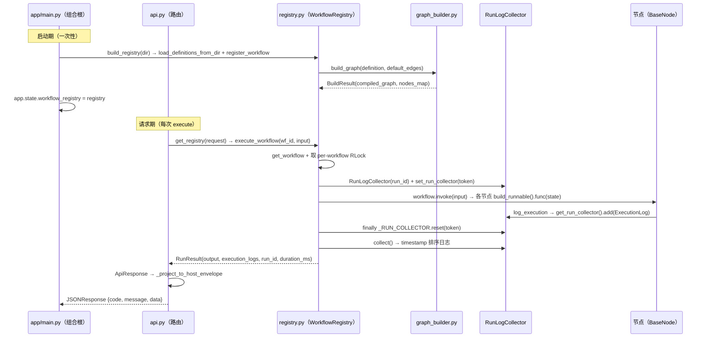

# 工作流引擎 API 与 Trace 轨迹支持方案

| 项 | 值 |
| --- | --- |
| 文档角色 | Workflow HTTP API 接口规范 + 轨迹（Trace）追踪机制设计 + execution_logs API 暴露方案（已决策 · 代码后续任务） |
| 依据文件 | `spec/CONTRACT.md` §4.10/§4.11/§4.12、`spec-08-入口集成.md`、`app/workflow/{api,cli,registry}.py`、`app/workflow/nodes/base.py` |
| 涉及编号 | H1/H3/H4/H6/H7、D3、S10/S11/S12/S13、R6、C6、AD-02/AD-10、CONTRACT §4/§5/§11 |
| 适用版本 | `app.workflow.__version__ = 0.1.0` |

> 本文档描述 Phase 8（入口集成，AD-10）**已落地**的 API 与 Trace 现状，并给出 execution_logs API 暴露的**已决策方案**。
> 现状部分与代码逐签名核对（见 §6 符合性对照表）；§7 为**决策通过、代码待实现**的变更提案
> （方案 A：在 execute 响应 `metadata` 内嵌 `execution_logs`，供前端展示 workflow 执行过程）。

---

## 1. 现状架构（Phase 8 已落地，AD-10）

### 1.1 组合根数据流

引擎自包含（不 import `app.core.*`，AD-02）；HTTP 集成由宿主组合根装配。`api.py` 是 spec-08 唯一允许
import `app.core.*` 的入口层例外（AD-02 composition-root exception）。

```
app/main.py（组合根）
  └─ app.state.workflow_registry = build_registry(DEFAULT_CONFIG_DIR)   # 启动时一次性构建注入（H4/G7）
        │  DEFAULT_CONFIG_DIR = app/workflow/config/examples
        ▼
app/api/v1/api.py
  └─ api_router.include_router(workflow_router, tags=["Workflow"])       # 挂载路由
        ▼
app/workflow/api.py
  └─ get_registry(request) ← request.app.state.workflow_registry         # DI 读取注入的注册表
  └─ POST /api/v1/workflows/{workflow_id}/execute
        ▼
app/workflow/registry.py
  └─ WorkflowRegistry.execute_workflow(...)                              # per-workflow RLock + 运行级日志收集
```

关键约束：

- **引擎无模块级缓存 / 可变全局**（H4/G7）：注册表由宿主显式持有并注入 `app.state`，`api.py` 每次请求经
  `get_registry(request)` 读取，缺失注入抛 `RuntimeError`（在 try 内解析 → 落入失败信封，R6）。
- **CLI 与 HTTP 共用同一引擎内核**：两者都调 `build_registry` / `registry.execute_workflow`，
  仅在**出口信封**上分形态（§3）。

### 1.2 双入口对照

| 维度 | CLI（`cli.py`） | HTTP（`api.py`） |
| --- | --- | --- |
| 触发 | `python -m app.workflow run` | `POST /api/v1/workflows/{id}/execute` |
| 注册表来源 | `build_registry(--dir)` 现场构建 | `app.state.workflow_registry`（宿主注入） |
| 执行 | 同步 `registry.execute_workflow` | `run_in_threadpool(registry.execute_workflow, ...)`（AD-10） |
| 日志配置 | `setup_logging` 自举（CLI 独立场景） | 幂等跳过，由 `app.core.logging` 全权负责（AD-02 v2） |
| 出口信封 | stdout `{success,data,error,metadata}`（§4.12 原样） | HTTP wire `{code,message,data}`（宿主统一信封） |
| 限流 | 无 | slowapi `@limiter.limit`（`workflows_execute`） |

---

## 2. API 接口规范

### 2.1 端点定义

```
POST /api/v1/workflows/{workflow_id}/execute
```

| 项 | 值 |
| --- | --- |
| 路由标签 | `Workflow`（`include_router(..., tags=["Workflow"])`） |
| 路径参数 | `workflow_id: str`——已注册的 workflow |
| 请求体 | `payload: dict[str, Any] \| None`——可选 JSON 对象，作为 workflow 输入；缺省视为 `{}` |
| 限流 | `settings.RATE_LIMIT_ENDPOINTS["workflows_execute"][0]`（默认 `20 per minute`） |
| 返回 | `JSONResponse`，携带宿主统一信封（200/404/500） |

### 2.2 执行流程

```python
@router.post("/workflows/{workflow_id}/execute", response_model=HostApiResponse[dict[str, Any]], responses={404, 500})
@limiter.limit(settings.RATE_LIMIT_ENDPOINTS["workflows_execute"][0])
async def execute_workflow(request: Request, workflow_id: str, payload: dict[str, Any] | None = None) -> JSONResponse:
    logger.info("api_workflow_execution_requested", workflow_id=workflow_id)
    input_data = payload or {}
    try:
        registry = get_registry(request)                                             # DI；缺失注入 → RuntimeError（R6）
        result = await run_in_threadpool(registry.execute_workflow, workflow_id, input_data)  # 同步内核入线程池（AD-10）
    except WorkflowNotFoundError as exc:
        logger.warning("api_workflow_not_found", workflow_id=workflow_id)
        return _project_to_host_envelope(ApiResponse(success=False, error=_redacted_summary(...)), 404)
    except Exception as exc:                                                          # noqa: BLE001 — 显式 catch-all（R6）
        logger.exception("api_workflow_execution_failed", workflow_id=workflow_id)
        return _project_to_host_envelope(ApiResponse(success=False, error=_redacted_summary(...)), 500)

    definition = registry.get_workflow_definition(workflow_id)
    response = ApiResponse(success=True, data=result.output, metadata={
        "workflow_id": workflow_id, "run_id": result.run_id,
        "duration_ms": result.duration_ms, "node_count": len(definition.nodes) if definition else 0,
    })
    return _project_to_host_envelope(response, 200)
```

要点：

- **同步内核入线程池**：`registry.execute_workflow` 是同步阻塞（内部 `workflow.invoke`），经
  `run_in_threadpool` 包装避免阻塞事件循环（AD-10）。
- **显式错误分层**（R6）：`WorkflowNotFoundError` → 404；catch-all（`# noqa: BLE001`）→ 500；
  两层都记录日志（404 用 `warning`，500 用 `logger.exception` 保留 traceback）。
- **脱敏出口**（H6）：失败 `message` 经 `_redacted_summary`（内部调 `redact_processor`）脱敏，
  密钥样式片段替换为 `***`，不含完整 state 与堆栈。

### 2.3 响应信封（统一 `{code, message, data}`）

HTTP 出口把内部 `ApiResponse`（CONTRACT §4.12）投影为宿主统一信封，由 `_project_to_host_envelope` /
`_host_envelope_content` **独占产出**：

| 场景 | HTTP status | `code` | `message` | `data` |
| --- | --- | --- | --- | --- |
| 成功（输出为 dict） | 200 | 200 | `"success"` | `{**output, "metadata": {...}}`（metadata 折叠进输出） |
| 成功（输出非 dict） | 200 | 200 | `"success"` | `{"result": <output>, "metadata": {...}}` |
| 未知 workflow_id | 404 | 404 | 脱敏错误摘要 | `null` |
| 执行失败 | 500 | 500 | 脱敏错误摘要 | `null` |

`metadata` 恒含四键：`workflow_id` / `run_id` / `duration_ms` / `node_count`。

> `response_model=HostApiResponse[dict[str, Any]]` 与 `responses={404,500}` **仅用于 OpenAPI 文档化**：
> 端点返回 `JSONResponse` 实例，FastAPI 跳过序列化，wire 形态完全由 `_project_to_host_envelope` 决定，
> `response_model`/`responses` 不改变任何运行时行为。

成功响应示例（`demo_http`，实测原样）：

```json
{
  "code": 200,
  "message": "success",
  "data": {
    "input": "hi",
    "history": ["fetch: ..."],
    "fetch_result": {"status_code": 200, "url": "https://example.com/api/items", "response": {"items":["alpha","beta"]}},
    "metadata": {"workflow_id": "demo_http", "run_id": "a1b2c3...", "duration_ms": 0.7, "node_count": 1}
  }
}
```

> `data` 主体为运行结束的 state 投影（声明通道 + 自动注入 `history` + 执行过节点的 `{node}_result` 槽位，EXP-G8/S4）；
> 平铺字段若未在 `state_schema` 声明则被 langgraph 丢弃。成功且输出为 dict 时，`metadata` 被折叠进 `data`。

失败响应示例（未知 id）：

```json
{"code": 404, "message": "workflow not found: no_such_wf", "data": null}
```

---

## 3. 出口信封投影：CLI §4.12 vs HTTP 宿主信封

内部 `ApiResponse`（CONTRACT §4.12，CLI 与 HTTP 共用）：

```python
@dataclass
class ApiResponse:
    success: bool
    data: Any = None
    error: str | None = None
    metadata: dict[str, Any] = field(default_factory=dict)
    def to_json(self) -> str: ...        # ensure_ascii=False
```

| 维度 | CLI stdout（§4.12 原样） | HTTP wire（宿主统一信封） |
| --- | --- | --- |
| 顶层字段 | `{success, data, error, metadata}` | `{code, message, data}` |
| 成功标识 | `success: true` | `code == HTTP status`，`message: "success"` |
| 失败标识 | `success: false`，`error: <脱敏摘要>` | `code`（404/500），`message: <脱敏摘要>`，`data: null` |
| metadata 位置 | 顶层独立键 | 折叠进 `data`（dict 输出）或并列（非 dict 输出） |
| 投影函数 | 直接 `to_json()`（T201 豁免点，G8） | `_project_to_host_envelope` |

> CLI stdout 保留未经改动的 §4.12 信封（回归基线，`tests/unit/workflow/test_cli.py`）；
> HTTP wire 形态是 §4.12 信封在 egress 的投影，二者不互相污染。

---

## 4. Trace 轨迹机制

轨迹（Trace）= 一次 workflow 运行内**每个已执行节点**的 `ExecutionLog` 序列。引擎的运行级日志收集
以 `RunLogCollector` + `_RUN_COLLECTOR` ContextVar 实现线程安全、并发隔离的收集（H1/H3/D3/S11）。

### 4.1 数据结构

```python
class ExecutionLog(BaseModel):        # models.py，CONTRACT §4.2
    node_name: str
    node_type: str
    timestamp: datetime               # 默认 datetime.now
    input_data: dict                  # 只记摘要，不含密钥与完整 state（H6/S15）
    output_data: dict
    execution_time_ms: float
    error: str | None = None

@dataclass(frozen=True)
class RunResult:                      # registry.py，CONTRACT §4.10
    workflow_id: str
    run_id: str                       # uuid4().hex，每 run 唯一
    output: dict[str, Any]
    execution_logs: list[ExecutionLog]  # 本 run 的完整轨迹（timestamp 排序）
    started_at: datetime
    finished_at: datetime
    @property
    def duration_ms(self) -> float: ...
```

### 4.2 RunLogCollector（run-scoped，H1/H3）

```python
class RunLogCollector:
    """运行级日志收集器，与共享节点实例解耦（H3）。"""
    def __init__(self, run_id: str) -> None:
        self.run_id = run_id
        self._logs: list[ExecutionLog] = []
        self._lock = threading.Lock()          # 收集本身线程安全

    def add(self, log: ExecutionLog) -> None:
        with self._lock:
            self._logs.append(log)

    def collect(self) -> list[ExecutionLog]:
        with self._lock:
            return sorted(self._logs, key=lambda log: log.timestamp)   # timestamp 排序副本
```

- **与节点实例解耦**（H3）：收集器不依赖"清空共享节点实例历史"来聚合日志；节点在 `log_execution` 时
  把条目**镜像**写入当前活跃收集器，因此覆盖本次运行**实际执行的每个节点**，无论其创建路径。

### 4.3 ContextVar 传播链（S11）

`_RUN_COLLECTOR` 是 `nodes/base.py` 定义的模块级 ContextVar（CONTRACT §4.4）：

```python
_RUN_COLLECTOR: ContextVar[RunLogCollectorLike | None] = ContextVar("workflow_run_collector", default=None)
def set_run_collector(collector) -> Token: ...
def get_run_collector() -> RunLogCollectorLike | None: ...
```

传播链（`registry.execute_workflow` 内）：

```
execute_workflow(wf_id, input):
  run_lock = per-workflow RLock            # S10：同一 wf 串行
  with run_lock:
    run_id = uuid4().hex
    collector = RunLogCollector(run_id)
    token = set_run_collector(collector)   # ← 绑定到当前上下文（线程/协程/线程池 worker）
    try:
        output = workflow.invoke(input)    # 节点执行时 log_execution → get_run_collector().add(...)
    finally:
        _RUN_COLLECTOR.reset(token)        # ← 配对复位，ContextVar 绝不泄漏（S11）
    logs = collector.collect()
    definition.execution_history = logs    # 单槽位，只留最近一次（S12）
    return RunResult(..., execution_logs=logs, ...)
```

节点侧（`BaseNode.log_execution`，见 Node 开发规范 §2.3）：

```python
def log_execution(self, execution_log):
    self._execution_history.append(execution_log)      # 实例历史
    collector = get_run_collector()                     # 当前 run 的收集器（可能为 None）
    if collector is not None:
        collector.add(execution_log)                    # 镜像写入运行级收集器
```

### 4.4 并发隔离双防线（H1/D3/S10）

| 防线 | 机制 | 隔离对象 | 编号 |
| --- | --- | --- | --- |
| 第一道 | per-workflow `RLock` 串行化同一 workflow 的 `execute_workflow` | 同一 workflow 的并发 run 互斥执行 | S10/ADR-004 |
| 第二道 | `_RUN_COLLECTOR` ContextVar 运行级绑定 | 不同 run / 不同 workflow 的日志互不串扰 | H1/D3/S11 |
| 元数据守护 | `_meta_lock` 守护锁表懒创建 + register/delete 映射变更 | 注册表结构并发安全 | S10/S13 |

- **同一 workflow 并发**：`RLock` 串行化，每个 run 仍拿到独立 `RunLogCollector` 与唯一 `run_id`
  （`test_concurrent_same_workflow_logs_isolated`，16×64，断言 run_id 全唯一、每 run 日志恰覆盖执行节点）。
- **不同 workflow 并发**：per-workflow 锁互不阻塞，交错并行执行
  （`test_different_workflows_not_blocked`，共享 `threading.Barrier(2)` 会合证明并发）。
- **ContextVar 不泄漏**：`try/finally` 用 token 配对 set/reset（`test_collector_reset_after_run`，S11）。

### 4.5 禁止反模式（H1）

- **运行时禁止依赖 `clear_execution_history()` 收集日志**：日志隔离由 ContextVar 保证，不靠清空共享节点实例。
  机器检查：`grep -n "clear_execution_history" app/workflow/registry.py` 期望零命中。
- **禁止模块级无界缓存**（H4/R10）：注册表不是缓存，是宿主注入的运行时持有物；引擎无 `lru_cache` / 模块级 dict 缓存。
- **禁止构建期注册表快照**（H5）：`GraphBuilder` 构造器无 registry 参数，不持有任何注册表引用。

### 4.6 Trace 数据出口

| 出口 | 内容 | 生命周期 | 编号 |
| --- | --- | --- | --- |
| `RunResult.execution_logs` | 本 run 完整轨迹（timestamp 排序） | 每 run 一份，frozen dataclass 不可变 | S11 |
| `definition.execution_history` | 最近一次运行的日志 | **单槽位**，只留最近一次（防无界增长） | S12 |
| `registry.get_execution_history(wf)` | 最近一次运行历史副本 | 查询接口 | §4.10 |
| `registry.get_node_execution_history(wf, node)` | 按节点名过滤的历史 | 查询接口 | §4.10 |
| `registry.get_registry_stats()` | `workflow_count` / `workflow_ids` / `node_count` | 注册表级计数 | §4.10 |
| HTTP `metadata` | `workflow_id`/`run_id`/`duration_ms`/`node_count`（**不含** execution_logs 明细） | 每响应一份 | §2.3 |

> **现状边界（代码待更新）**：当前 HTTP execute 响应的 `metadata` 只携带运行摘要（run_id/duration_ms/node_count），
> 尚**不返回** `execution_logs` 明细；轨迹明细目前仅在进程内（`RunResult` / registry 查询接口）可得。
> **已决策**在 execute 响应 `metadata` 内嵌 `execution_logs`，供前端展示逐节点执行过程（方案 A，见 §7.1）；
> 属 CONTRACT §4.12 `ApiResponse.metadata` 语义扩展（新增键，向后兼容），**代码实现为后续任务**。

---

## 5. registry.py 与 api.py 流转时序

### 5.1 时序图



### 5.2 加载 → 注册 → 执行 → 出口

| 阶段 | 函数 | 关键语义 | 编号 |
| --- | --- | --- | --- |
| 加载 | `load_definitions_from_dir(dir)` | 递归 `*.yaml`/`*.yml`，文件名排序；**fail-fast**：任一文件失败抛带路径 `ValueError`；空/缺目录记 warning 返回 `[]` | S16 |
| 注册 | `register_workflow(definition, *, default_edges)` | `_ensure_operator_logs` 通用填充（无类型特判）→ `GraphBuilder.build_graph` → `_meta_lock` 下写入四表；重复注册 = 原子替换（先 `delete_workflow`） | S13 |
| 删除 | `delete_workflow(wf_id)` | **唯一删除入口**（C6/H7）：`_meta_lock` 下同步删 `_registry`/`_definitions`/`_nodes_map`/`_run_locks` 四表条目 | S13/H7 |
| 执行 | `execute_workflow(wf_id, input)` | per-workflow RLock + run-scoped collector + `workflow.invoke` + finally reset；节点异常原样上抛（EXP-G7） | S10/S11 |
| 出口 | `RunResult` → `ApiResponse` → `_project_to_host_envelope` | CLI 走 §4.12 原样，HTTP 走宿主信封 | §3 |

`_ensure_operator_logs`（无类型特判，替换旧领域分支）：

```python
def _ensure_operator_logs(self, definition):
    for node in definition.nodes:
        if node.name not in definition.operator_logs:
            definition.operator_logs[node.name] = OperatorLog(node_name=node.name, input_schema={}, output_schema={})
```

---

## 6. CONTRACT §4 符合性对照表

逐签名核对最终代码与 CONTRACT §4 冻结清单（spec-09 TC4）。**现状零偏差**。

| CONTRACT 条目 | 冻结签名 | 代码落点 | 符合 |
| --- | --- | --- | --- |
| §4.10 `RunResult` | frozen dataclass，6 字段 + `duration_ms` property | `registry.py` L41-55 | ✓ |
| §4.10 `RunLogCollector` | `__init__(run_id)` / `add(log)`（加锁）/ `collect()`（timestamp 排序副本） | `registry.py` L58-80 | ✓ |
| §4.10 `WorkflowRegistry.__init__` | `*, no_match_policy: Literal["raise","default"]="raise"` | `registry.py` L94 | ✓ |
| §4.10 `execute_workflow` | `(workflow_id, input_data) -> RunResult` | `registry.py` L155 | ✓ |
| §4.10 `delete_workflow` | 唯一删除入口，四表同步 | `registry.py` L127-136 | ✓ |
| §4.10 查询接口 | `get_workflow_definition`/`get_operator_logs`/`get_execution_history`/`get_node_execution_history`/`get_node_by_name`/`get_registry_stats` | `registry.py` L192-224 | ✓ |
| §4.10 `load_definitions_from_dir` | `(directory) -> list[WorkflowDefinition]` | `registry.py` L246 | ✓ |
| §4.11 `setup_logging` | 幂等 bootstrap，已被外部配置则跳过（AD-02 v2） | `logging_conf.py` L106 | ✓ |
| §4.11 `redact` / `redact_processor` | 递归脱敏 + structlog processor 形态 | `logging_conf.py` L60/L87 | ✓ |
| §4.12 `ApiResponse` | `success/data/error/metadata` + `to_json`（ensure_ascii=False） | `cli.py` L32-49 | ✓ |
| §4.12 `build_registry` / `build_parser` / `main` | CLI 入口三函数 | `cli.py` L52/L60/L82 | ✓ |
| §4.4 `_RUN_COLLECTOR` / `set_run_collector` / `get_run_collector` | ContextVar 钩子 | `nodes/base.py` L30-40 | ✓ |
| §4.4 `BaseNode.log_execution` | 写实例历史 + 运行级收集器 | `nodes/base.py` L74-79 | ✓ |

`api.py` 为 spec-08【可选】任务（AD-10），已实施；其签名不在 §4 冻结清单内（§4 只冻结引擎内核），
但必须满足 AD-10 约束：slowapi 限流装饰器、DI、同步内核经 `run_in_threadpool`、structlog——逐项已落实。

---

## 7. execution_logs API 暴露方案（已决策 · 代码为后续任务）

现状 HTTP execute 响应的 `metadata` 只携带运行摘要，**不含** `execution_logs` 明细（§4.6 边界）。为支持
**前端展示 workflow 逐节点执行过程**，已决策在 API 层暴露 `execution_logs`。本节记录**已通过的变更提案**
与落地设计；**代码实现为后续任务**，本节描述目标形态与约束，供实现时逐条对齐。

按 CONTRACT §11 变更管理，本变更属 §4.12 `ApiResponse.metadata` **语义扩展**（新增键、向后兼容），提案已由
人类决策者拍板通过：

> 动机（前端展示执行过程）→ 评审（决策通过）→ **待同步**：CONTRACT.md §4.12 metadata 语义 + spec/README 引用处
> → 受影响代码（`api.py` egress 投影）与测试。实现前**不得先改代码后补契约**（§11）；提交信息 `docs:`（契约先行）
> 与 `feat:`（后续代码实现）分离。

### 7.1 采用方案 A：execute 响应 `metadata` 内嵌 execution_logs

**决策**：采用方案 A —— 在 `POST /api/v1/workflows/{workflow_id}/execute` **成功响应**的 `metadata` 内嵌本次运行的
`execution_logs`（序列化自 `RunResult.execution_logs`）。前端一次请求即拿到「输出 + 轨迹」，无需新增端点与存储。

选型理由（对齐「方便前端展示过程」）：

- 前端执行一次 workflow 后**立即**获得逐节点轨迹用于展示，交互路径最短（无需二次查询）；
- 引擎内核（`registry.py` / `nodes/*`）**零改动**：`RunResult.execution_logs` 已在内核产出（§4.6），改动只落在 `api.py` egress；
- **不引入运行历史存储**，不突破 S12（单槽位历史）/ H4（无模块级缓存）；
- 新增键**向后兼容**：老客户端忽略 `metadata.execution_logs` 即可，既有四键与 `data` 主体不变。

目标响应形态（成功、dict 输出；`execution_logs` 为 `metadata` 新增第五键）：

```json
{
  "code": 200,
  "message": "success",
  "data": {
    "input": "hi",
    "history": ["fetch: ..."],
    "fetch_result": {"status_code": 200, "url": "https://example.com/api/items", "response": {"items": ["alpha", "beta"]}},
    "metadata": {
      "workflow_id": "demo_http",
      "run_id": "a1b2c3...",
      "duration_ms": 0.7,
      "node_count": 1,
      "execution_logs": [
        {
          "node_name": "fetch",
          "node_type": "http",
          "timestamp": "2026-09-07T12:00:00.000000",
          "input_data": {"...": "脱敏摘要"},
          "output_data": {"...": "脱敏摘要"},
          "execution_time_ms": 0.5,
          "error": null
        }
      ]
    }
  }
}
```

落地要点（代码后续任务须遵守）：

- **序列化**：`ExecutionLog` 为 pydantic v2 模型（CONTRACT §4.2），用 `model_dump(mode="json")` 序列化，
  `datetime` 自动转 ISO-8601 字符串，保证 `JSONResponse` 可编码；
- **脱敏（H6/S15）**：egress 前对每条 log 的 `input_data` / `output_data` 施加 `logging_conf.redact`
  （`redact(data, *, max_len=500)`：密钥样式键值替换为 `***REDACTED***`、超长字符串以 `...(truncated)` 截断），
  杜绝完整 state / 密钥经响应体外泄；`ExecutionLog` 本身已「只记摘要」，此处为出口二次兜底；
- **仅成功响应内嵌**：404 / 500 失败信封 `data=null` 保持不变（无轨迹可返回）；
- **投影位置**：改动集中在 `execute_workflow` 成功分支的 `metadata` 构造（追加 `execution_logs`）与
  `_host_envelope_content`（dict 输出时 `metadata` 折叠进 `data` 的现状逻辑不变）；`registry.py` 不动；
- **限流 / DI / 信封不变**：沿用现状 execute 端点（slowapi `workflows_execute`、`get_registry` DI、宿主统一信封，AD-10），
  **不新增端点**；`response_model` 仅 OpenAPI 文档化，wire 形态仍由 `_project_to_host_envelope` 独占产出（§2.3）；
- **契约影响**：§4.12 `ApiResponse.metadata` 由「恒含四键」扩展为「四键 + 可选 `execution_logs`」→ 需 CONTRACT §11 记录（见本节引言）。

### 7.2 当前范围外：独立 Trace 查询端点 + 运行历史存储（方案 B）

方案 B（`GET /api/v1/workflows/{workflow_id}/runs/{run_id}` 或 `.../runs` 列表 + 持久化多 run 历史）面向
**跨请求、可回溯的多 run 轨迹查询**（类 Langfuse trace 浏览）。当前需求为「前端展示**单次**执行过程」，
方案 A 已充分覆盖，故方案 B **不在本次范围**，仅留档备查：

- 需新增存储层（DB / 文件）与 run 索引，**突破**现状 S12（单槽位历史）/ H4（无缓存）——影响面最大；
- 新增端点须带 slowapi 限流、DI、统一信封（AD-10）；
- 轨迹持久化引入数据保留 / 脱敏 / 隐私合规问题（H6）；
- 契约影响：新增 §4 冻结签名 + 新增 S 语义（运行历史多槽位）→ 需 CONTRACT §11 完整变更。

如后续出现多 run 回溯需求，再按 §11 独立提案。届时 **Langfuse 等外部观测**应作为**宿主组装点**的观测钩子，
不得让引擎模块 import `app.core.*` 之外的观测库（AD-02 引擎自包含红线不变）。

### 7.3 方案对比（决策留档）

| 维度 | 方案 A（metadata 内嵌，**已采用**） | 方案 B（独立端点 + 存储，范围外） |
| --- | --- | --- |
| 引擎内核改动 | 无 | 需新增存储 + 多槽位历史 |
| 新增端点 | 无 | 有（1-2 个） |
| 向后兼容 | 是（新增键） | 是（新端点） |
| 契约变更量 | 小（§4.12 metadata 语义扩展） | 大（§4 新签名 + 新 S 语义） |
| 多 run 回溯 | 不支持 | 支持 |
| 与 H4/S12 冲突 | 无 | 有（突破单槽位 / 无缓存） |
| 前端展示单次过程 | 一次请求即得 | 需二次查询 |

---

## 8. 相关文档

- 编码契约（§4.10/§4.11/§4.12）：[spec/CONTRACT.md](workflow-reimpl-plan/spec/CONTRACT.md)
- 入口集成（Phase 8，AD-10）：[spec-08-入口集成.md](workflow-reimpl-plan/spec/spec-08-入口集成.md)
- 注册表与运行时（Phase 7，H1/S10/S11）：[spec-07-注册表与运行时.md](workflow-reimpl-plan/spec/spec-07-注册表与运行时.md)
- 隐患修复方案（H1/H3/H4/H5/H6/H7）：[03-隐患修复方案.md](workflow-reimpl-plan/03-隐患修复方案.md)
- Node 开发规范（BaseNode 契约 / log_execution）：[workflow-node-development.md](workflow-node-development.md)
- 手动测试指南（HTTP API 三场景 / 并发日志隔离）：[workflow-manual-testing.md](workflow-manual-testing.md)
